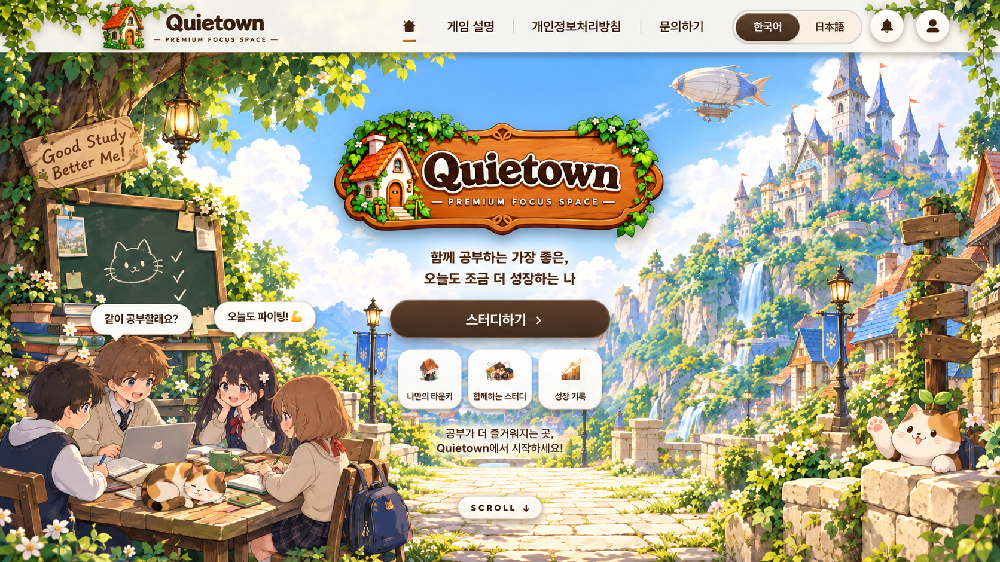
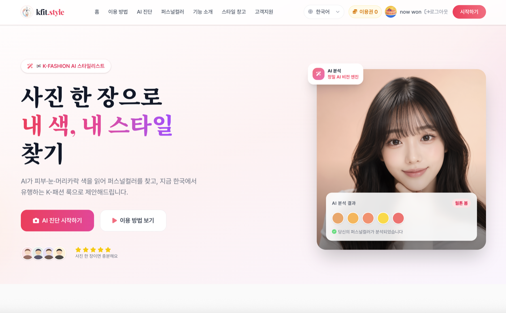

### 안녕하세요! 모바일 풀스택 개발자 **노원상**입니다 👋

Android · iOS · Web · Server · Infra — 기획부터 배포·운영까지 풀사이클을 다루는 6년 차 개발자입니다.

  

<!-- 탭 네비게이션 -->

 

## 🚀 운영 중인 개인 서비스

<table>
<tr>
<td width="42%" align="center" valign="top">

</td>
<td width="58%">

### 🏡 Quietown

**3D 멀티플레이 가상 스터디 공간** &nbsp; 

나만의 3D 아바타로 라운지·도서관·독서실 등 다양한 맵에 모여 함께 공부하고, 포모도로 세션을 완료해 모은 코인으로 아바타를 꾸미는 웹 서비스입니다.

- 🙋 기획 · 개발 · 배포 · 운영 **1인 풀사이클** 수행
- 🌐 Durable Objects 기반 실시간 멀티플레이 · 채팅 · WebRTC 화상 대화
- 🧊 Three.js(R3F) 3D 맵 7종 · AI 3D 에셋 파이프라인(리깅 · 애니메이션) 구축
- 🪙 서버 권위 경제(코인 · XP · 레벨) · 🔐 Google · Kakao · GitHub 소셜 로그인
- 🌏 한국어 · 일본어 다국어 지원

     

</td>
</tr>
<tr>
<td width="42%" align="center" valign="top">

</td>
<td width="58%">

### 🎨 kfit.style

**AI 퍼스널컬러 & K-스타일 진단 서비스** &nbsp; 

사진 한 장으로 AI가 퍼스널컬러를 진단하고, 얼굴은 그대로 유지한 채 K-패션 전신 코디 6가지를 생성하는 웹 서비스입니다.

- 🙋 기획 · 개발 · 배포 · 운영 **1인 풀사이클** 수행
- 🤖 OpenAI 이미지 생성 파이프라인 직접 설계 · 운영
- 🔐 Google OAuth 로그인 · 💳 Polar 결제 연동
- 📈 GA4 · Microsoft Clarity 기반 사용자 행동 모니터링

     

</td>
</tr>
</table>

 

## 🛠️ Tech Stack

> 상세 기술 스택과 프로젝트별 활용 내역은 [포트폴리오](https://portfolio-website-7e1.pages.dev/)에서 확인하실 수 있습니다.

#### 📱 Mobile

  
  
  
  

#### 🌐 Web Frontend

  
  
  
  

#### ⚙️ Backend

  
  
  
  
  

#### ☁️ Infra & DevOps

  
  
  
  
  

#### 🤖 AI

  
  
  
  

#### 🛡️ Security & Monitoring

  
  
  

 

## 📊 GitHub Stats

  

 

